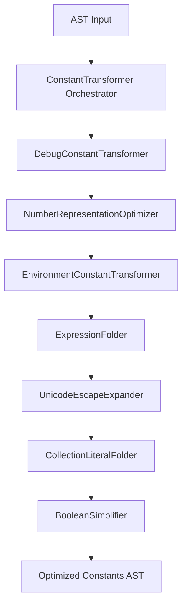

# py-terser Design & Update Plan

`python-minifier` → `py-terser` upgrade. Target: Python >= 3.12 (Vercel serverless / FastAPI / FastMCP).

---

## 0. General Implementation Philosophy
* **AST-Driven Analysis & Transformation:**
  - **No string parsing or regex** for code structures (decorators, names, bases, imports, typing).
  - Use AST nodes, context tracking, parent-child mapping, name binding DBs for all decisions.

---

## 1. Redesigned & New Transformation Passes

### T1. `RemoveDocstrings` (Refactored `RemoveLiteralStatements`)
* **Behavior:**
  - Delete docstrings from modules, classes, functions.
  - Non-docstring literal statements stay.
* **Preservation rules:**
  - `@terser.hints.preserve_docstring` → always preserve docstring.
  - `strict` option (bool, default `True`).
    - `strict=False`: always strip module-level docstrings.
    - `strict=True`: preserve module-level docstrings unless overridden.

### T2. `RemoveAnnotations` & `RemoveTypeHints` (Split Pass)
* **`RemoveAnnotations` (Class Attribute/Field focus):**
  - Targets `ClassDef` only.
  - **BaseModel & @dataclass:** No-touch annotations of fields inheriting `BaseModel` or decorated `@dataclass`.
  - **`typing.Annotated`:** Preserve if any class field uses `Annotated` (e.g. `x: Annotated[int, Field(...)]`).
  - **Literal Types:** String-literal annotations (e.g., `x: "Foo"`) → remove.
* **`RemoveTypeHints` (Variables & Functions focus):**
  - Targets local vars and functions.
  - **`typing.Annotated`:** Preserve if function arg annotated with `Annotated` (e.g. `auth: Annotated[Credentials, Depends(...)]`). Else strip.
  - **Literal Return Types:** Strip string/literal return annotations (e.g., `def foo() -> "Foo"`).

### T3. `RemovePass` (Rescheduled Pass)
* Run as **final** transformation pass.
* Rationale: other passes may create empty blocks or leave redundant `pass`. Running last ensures clean suites.

### T4. `RemoveObject` (Deleted Pass)
* **Status:** **Removed** from pipeline.
* Rationale: Python >= 3.12 — explicit `object` inheritance obsolete, linter-flagged.

### T5. Advanced Constant Handling (`ConstantTransformer` Framework)



* **`ConstantTransformer` (Base Class):** Abstract visitor. Helpers for evaluating expressions, verifying round-trips, replacing nodes.
* **Sub-Transformers:**
  1. **`DebugConstantTransformer`**: Replaces `__debug__` and `typing.TYPE_CHECKING` with `False`.
  2. **`NumberRepresentationOptimizer`**: Minimizes base representations (`0b1` -> `1`, `0xF` -> `15`). Picks shortest: decimal vs scientific (`1000000` -> `1e6`, `0.0001` -> `1e-4`).
  3. **`EnvironmentConstantTransformer`**: Replaces `sys.version_info` / `sys.platform` with configured constants (e.g., `(3, 12, 0)`, `"linux"`).
  4. **`ExpressionFolder`**: Constant-folds math, unary, binary ops for primitives. Extends to Python >= 3.12 syntax and division.
  5. **`UnicodeEscapeExpander`**: Expands `\uXXXX` / `\UXXXXXXXX` to raw UTF-8 in string/bytes literals.
  6. **`CollectionLiteralFolder`**: `list()` -> `[]`, `dict()` -> `{}`, `tuple()` -> `()`. `set([1, 2])` -> `{1, 2}` if space-efficient.
  7. **`BooleanSimplifier`**: Simplifies comparisons/negations (`not x is None` -> `x is not None`, `x == False` -> `not x`, `x == True` -> `x`).

### T6. `RemoveAsserts`
* Maintained; config merged into general debug options.

### T7. Branch / Dead Code Eliminator
* Evaluates `If` with statically resolved tests:
  - `if True: body [else: orelse]` → inline `body`.
  - `if False: body [else: orelse]` → inline `orelse` or remove.
* Recursively cleans empty/dead branches.

### T8. `@typing.overload` Sweeper
* Remove all functions decorated with `@overload` or `@typing.overload` — static typing only.

### T9. Contract Resolver & Inline decorator
* **Contract decorators:**
  - `@contract("func -> func()")` or `@lambda _: _()` → strip wrapper, inline inner code.
  - `typing.cast(Type, value)` → `value`.
  - Strip `unreachable()` / `assert_never()` calls.

### T10. Type Hint Decorators Sweeper
* Remove `@terser.hints.*`, `@typing.override`, `@typing.final`.

### T11. Dynamic Attr to Direct Attr Converter
* `getattr(obj, "foo")` -> `obj.foo`, `setattr(obj, "foo", bar)` -> `obj.foo = bar` for valid Python names, no default.
* **Safeguard:** Skip `__`-prefixed attributes (name mangling).

### T12. Inline Function pass
* Identify local functions called exactly once; inline at call site. Guided by inline decorators/hints.

### T13. Generic & TypeVar Sweeper
* Strip `TypeVar` declarations and generic brackets (`class MyClass[T]:` -> `class MyClass:`).

### T14. `enum.IntFlag` Simplifier
* Simplify methodless `IntFlag` classes marked for inlining: replace flag refs with raw integers, delete class.

### T15. Type Alias Sweeper (New)
* Strip PEP 695 `type` statements (e.g. `type MyType = int`) — annotations stripped anyway.

### T16. FStringOptimizer (New)
* Convert `JoinedStr` nodes to binary `Add` where shorter:
  - `f"{x}"` -> `str(x)` (or `x` if statically `str`).
  - `f"{a}{b}"` -> `a + b`.
  - `f"{a} {b}"` -> `a + " " + b`.

### T17. TernaryReturnOptimizer (New)
* `if cond: return a else: return b` → `return a if cond else b`.

### T18. IfShortCircuiter (New)
* Single-statement `if` with expression body:
  ```python
  if cond:
      func(x)
  ```
  → `ast.Expr` with logical `and`:
  ```python
  cond and func(x)
  ```

### T19. Dead Store Eliminator (New)
* Scan `Assign` nodes where target never read after.
  - `_` assignments → auto dead store.
  - Side-effect-free → remove entire statement.
  - Side-effectful → replace with bare expression (`x = expensive_call()` -> `expensive_call()`).

### T20. Unused Exception Name Pruner (New)
* `except Exception as e:` where `e` never referenced → `except Exception:` (saves 5 bytes).

### T21. Chained Assignment Consolidation (New)
* Consecutive same-value assignments → chained: `x = None\ny = None` -> `x = y = None`.

### T22. Local Constant Propagator (New)
* Inline short-constant vars (single digit, empty structures) referenced once/twice when propagation + deletion yields smaller byte size.

### T23. Lambda Converter (New)
* `def f(x): return expr` → `f = lambda x: expr` when shorter.
* Only when: no decorators, no docstring, no default args with side effects.

### T24. Else-After-Early-Exit Eliminator (New)
* `else` after definite early exit (`return`, `raise`, `continue`, `break`) → remove `else`, dedent body into parent scope.

### T25. Trailing Return Eliminator (New)
* Remove trailing `return None` / bare `return` at function end — Python returns `None` implicitly.

---

## 2. Global Obfuscation & Linking Updates

1. **Parameter Name Preservation:** `Annotated` args or keyword arg names (excl. `**kwargs`) → preserve.
2. **Local Reference Aliasing:** Frequently-referenced reserved names → bind to short local (`app = A = ...`).
3. **`__all__` stripping:** Drop after obfuscation complete.
4. **Dynamic Imports Resolution:** Module renamed → scan AST for `__import__("module_name")` / `importlib.import_module("module_name")`, update string args.
5. **Import Consolidation & Sorting:** Alias-assignment + sorting inside `CombineImports` / Name Assigners. Aliasing (e.g., `import fastapi as a`) determined by reference frequency across codebase.
6. **Conditional Compilation:** C-like `#ifdef` checks for conditional blocks.
7. **Concurrent Processing:** Multi-threaded pool for parsing, AST transform, unparsing across modules.

---

## 3. Strict Verification Checklist

### [x] AST-Driven Integrity
- [x] No regex/string replacements for AST manipulations.
- [x] AST parent pointers and namespace scopes fully linked before any pass.

### [x] T1. RemoveDocstrings
- [x] Non-docstring literal expressions preserved.
- [x] Docstrings removed except `@terser.hints.preserve_docstring` items.
- [x] `strict=False` → module-level docstrings unconditionally stripped.
- [x] `strict=True` → module-level docstrings preserved unless overridden.

### [x] T2. Split Annotation / Type Hint passes
- [x] `RemoveAnnotations` acts on `ClassDef` only.
- [x] Pydantic `BaseModel` and `@dataclass` fields fully preserved.
- [x] `typing.Annotated` class attributes preserved.
- [x] String-literal annotations in classes removed.
- [x] `RemoveTypeHints` acts on local vars and functions.
- [x] `Annotated` function args preserved.
- [x] Literal return annotations stripped.

### [x] T3. Final Pass RemovePass
- [x] `RemovePass` is absolute last pass of all AST-to-AST transforms.

### [x] T4. RemoveObject Removal
- [x] `RemoveObject` removed from active pipeline.

### [x] T5. ConstantTransformer orchestrator
- [x] Base `ConstantTransformer` provides utility visitor methods.
- [x] `DebugConstantTransformer` replaces `__debug__` / `TYPE_CHECKING` with `False`.
- [x] `NumberRepresentationOptimizer` folds radix numbers, converts large/small decimals to scientific when shorter.
- [x] `EnvironmentConstantTransformer` replaces `sys.version_info` / `sys.platform` with fixed constants.
- [x] `ExpressionFolder` folds math, unary, binary ops.
- [x] `UnicodeEscapeExpander` decodes `\uXXXX` / `\UXXXXXXXX` to raw UTF-8.
- [x] `CollectionLiteralFolder` folds empty constructors, set constructors if space-efficient.
- [x] `BooleanSimplifier` simplifies comparisons.

### [x] T6. RemoveAsserts Merging
- [x] Assertion removal config unified into debug flags.

### [x] T7. Branch / Dead Code Eliminator
- [x] Statically resolved conditionals pruned and inlined recursively.

### [x] T8 & T9 & T10. Decorators & Contracts Sweeper
- [x] `@overload` / `@typing.overload` functions completely removed.
- [x] `typing.cast(Type, value)` → `value`.
- [x] `unreachable()` / `assert_never()` stripped.
- [x] `@contract(...)` / `@lambda _: _()` wrapper removed, body inlined.
- [x] `@terser.hints.*`, `@typing.override`, `@typing.final` removed.

### [x] T11. Attr Converter Safeguard
- [x] Valid-identifier `getattr`/`setattr` → direct attribute access.
- [x] `__`-prefixed attrs bypassed.
- [x] `getattr` with default arg not converted.

### [x] T12. Inline Function pass
- [x] Once-called functions inlined at call site.
- [x] Inline decorator/hints respected.

### [x] T13. Generic / TypeVar Sweeper
- [x] TypeVar assignments removed.
- [x] PEP 695 generic brackets `[T]` on `ClassDef`/`FunctionDef` removed.

### [x] T14. enum.IntFlag Simplifier
- [x] Inlinable `IntFlag` classes deleted, refs replaced with raw integers.
- [x] Only methodless `IntFlag` classes qualify.

### [x] T15 & T16 & T17 & T18. New Syntax Optimization Passes
- [x] PEP 695 `type` alias statements stripped.
- [x] `JoinedStr` nodes reduced to `+` where it saves bytes.
- [x] Single-expression f-strings → `str(x)` or `x` if statically `str`.
- [x] if-else return blocks → single ternary returns.
- [x] Single-expression if-statements → logical `and`.

### [x] T19 & T20 & T21 & T22. General Minification Passes
- [x] Dead assignments pruned; side-effects preserved.
- [x] `_` assignments treated as dead stores.
- [x] Unused bound exceptions pruned to bare `except Exception:`.
- [x] Consecutive same-value assignments → chained.
- [x] Once/twice-referenced local constants propagated, definitions pruned.

### [x] T23. Lambda Converter
- [x] Single-expression no-decorator no-docstring functions → lambda when smaller.

### [x] T24. Else-After-Early-Exit Eliminator
- [x] `else` after definite early exit removed, body dedented into parent scope.

### [x] T25. Trailing Return Eliminator
- [x] Trailing `return None` / bare `return` at function end removed.

### [x] Global Obfuscation & Linking
- [x] `__all__` preserved during linking, dropped at final output.
- [x] Imports sorted and aliased by reference frequency.
- [x] Dynamic imports via `__import__` / `importlib.import_module` updated to obfuscated names.
- [x] `Annotated` args / keyword arg names (excl. `**kwargs`) excluded from renaming.
- [x] Frequently-referenced reserved names aliased to short locals.
- [x] `#ifdef` conditional blocks evaluated and resolved.
- [x] Multi-threaded pool for parsing, transforms, unparsing.