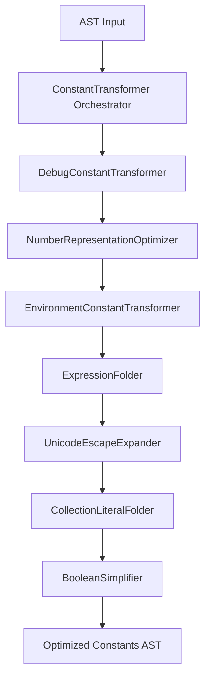

# py-terser Design & Update Plan

This document outlines the detailed architectural requirements, transformation passes, and implementation strategy for upgrading `python-minifier` to `py-terser` to target Python >= 3.12 (Vercel serverless / FastAPI / FastMCP).

---

## 0. General Implementation Philosophy
* **AST-Driven Analysis & Transformation:**
  - **Do NOT rely on simple string parsing or regex patterns** to analyze, modify, or match code structures (such as decorators, function names, class bases, imports, or typing constructs).
  - Actively and strictly utilize AST nodes, context tracking, parent-child mapping, and name binding databases for all decisions. This ensures syntactic correctness, robustness against formatting variations, and structural reliability.

---

## 1. Redesigned & New Transformation Passes

### T1. `RemoveDocstrings` (Refactored `RemoveLiteralStatements`)
* **Behavior:**
  - Delete docstrings from modules, classes, and functions.
  - Do **not** remove standalone literal statements (except docstrings), leaving non-docstring constant expressions alone (as linter checks handle this beforehand).
* **Preservation rules:**
  - If a function/class has `@terser.hints.preserve_docstring` decorator, **always** preserve its docstring.
  - Introduce a `strict` option (boolean, defaults to `True`).
    - If `strict=False`, always strip module-level docstrings.
    - If `strict=True`, preserve module-level docstrings if needed, or follow configured exceptions.

### T2. `RemoveAnnotations` & `RemoveTypeHints` (Split Pass)
* **`RemoveAnnotations` (Class Attribute/Field focus):**
  - Targets only class definitions (`ClassDef`).
  - **BaseModel & @dataclass Preservation:** Do not modify or remove type annotations of fields in classes inheriting from `BaseModel` (or decorated with `@dataclass`).
  - **`typing.Annotated` Preservation:** If any class field uses `Annotated` (e.g. `x: Annotated[int, Field(...)]`), preserve the annotation entirely.
  - **Literal Types:** If a field annotation is a string literal (e.g., `x: "Foo"`), always remove it.
* **`RemoveTypeHints` (Variables & Functions focus):**
  - Targets local variables and function definitions.
  - **`typing.Annotated` Preservation:** If a function argument is annotated with `Annotated` (e.g. `auth: Annotated[Credentials, Depends(...)]`), preserve the type annotation. Otherwise, strip the type hint.
  - **Literal Return Types:** Always strip return annotations if they are string/literal types (e.g., `def foo() -> "Foo"`).

### T3. `RemovePass` (Rescheduled Pass)
* **Behavior:** Run `RemovePass` as the **final** transformation pass.
* **Rationale:** Other passes (like dead-branch removal or type-hint stripping) may create empty blocks requiring a new `pass` statement, or leave existing `pass` statements redundant. Running it last ensures clean suites.

### T4. `RemoveObject` (Deleted Pass)
* **Status:** **Removed entirely** from the pipeline.
* **Rationale:** Target environment is Python >= 3.12, where explicit `object` inheritance is already obsolete and linter-flagged.

### T5. Advanced Constant Handling (`ConstantTransformer` Framework)
To support future extensibility, we will implement an abstract base class `ConstantTransformer` and orchestrate several specialized sub-transformers:



* **`ConstantTransformer` (Base Class):** An abstract visitor class providing helper methods for evaluating expressions, verifying round-trips, and replacing AST nodes.
* **Specialized Sub-Transformers:**
  1. **`DebugConstantTransformer`**: Replaces `__debug__` and `typing.TYPE_CHECKING` references with `False` constant nodes.
  2. **`NumberRepresentationOptimizer`**:
     - Minimizes base-based representations (e.g. `0b1` -> `1`, `0xF` -> `15`) by converting them to shorter decimal equivalents.
     - Automatically chooses the shortest notation between raw decimal and scientific notation (e.g. `1000000` -> `1e6`, `0.0001` -> `1e-4`).
  3. **`EnvironmentConstantTransformer`**: Identifies references to `sys.version_info` or `sys.platform` and replaces them with configured target constant values (e.g., `(3, 12, 0)` and `"linux"`).
  4. **`ExpressionFolder`**: Performs constant folding on mathematical, unary, and binary operations for primitive types (extended to Python >= 3.12 syntax and division operations).
  5. **`UnicodeEscapeExpander`**: Expands Unicode escape sequences (e.g. `\uXXXX` or `\UXXXXXXXX`) inside string/bytes literals to their raw UTF-8 equivalent characters to minimize character counts in the final output.
  6. **`CollectionLiteralFolder`**:
     - Converts empty constructors to literals: `list()` -> `[]`, `dict()` -> `{}`, `tuple()` -> `()`. (CPython optimizes this automatically to bypass global lookup and CALL instructions).
     - Converts non-empty constructors where size-efficient: `set([1, 2])` -> `{1, 2}`.
  7. **`BooleanSimplifier`**: Simplifies comparisons and logical negations (e.g., `not x is None` -> `x is not None`, `x == False` -> `not x`, `x == True` -> `x`).

### T6. `RemoveAsserts`
* **Status:** Maintained but its configuration option is merged into the general debugging options.

### T7. Branch / Dead Code Eliminator
* **Behavior:**
  - Evaluate conditional structures (`If`) with statically resolved test expressions:
    - `if True: body [else: orelse]` -> Inline `body` directly.
    - `if False: body [else: orelse]` -> Inline `orelse` directly (or remove if no `orelse`).
  - Cleans up empty branches and dead code branches recursively.

### T8. `@typing.overload` Sweeper
* **Behavior:** Scan all functions and completely remove any functions decorated with `@overload` or `@typing.overload` as they serve only static typing.

### T9. Contract Resolver & Inline decorator
* **Contract decorators:**
  - Support `@contract("func -> func()")` or `@lambda _: _()`. Strip the outer function/decorator structure and inline the inner function/code directly.
  - Strip functions like `typing.cast(Type, value)` and replace them with `value`.
  - Strip calls to user-defined runtime checks such as `unreachable()` or `assert_never()`.

### T10. Type Hint Decorators Sweeper
* **Behavior:** Remove decorators like `@terser.hints.*`, `@typing.override`, `@typing.final` from minified code.

### T11. Dynamic Attr to Direct Attr Converter
* **Behavior:** Convert `getattr(obj, "foo")` -> `obj.foo` and `setattr(obj, "foo", bar)` -> `obj.foo = bar` for allowed identifiers (valid Python names) when no default value is provided in `getattr`.
* **Safeguard:** Do **NOT** convert attributes starting with double underscore `__` to avoid issues with Python's compiler-level name mangling of class-private attributes.

### T12. Inline Function pass
* **Behavior:** Identify local functions that are called exactly once in the runtime code and inline them into their call site. Guided by inline decorators/hints.

### T13. Generic & TypeVar Sweeper
* **Behavior:** Strip all `TypeVar` declarations and generic brackets (e.g. `class MyClass[T]:` -> `class MyClass:`).

### T14. `enum.IntFlag` Simplifier
* **Behavior:** Simplify class definitions inheriting from `enum.IntFlag` if they have no methods and are marked for inlining: replace all references to their flags with raw integer values (magic numbers) and delete the class.

### T15. Type Alias Sweeper (New)
* **Behavior:** Strip PEP 695 `type` statements (e.g. `type MyType = int`) from the AST since annotations are stripped.

### T16. FStringOptimizer (New)
* **Behavior:** Convert `JoinedStr` nodes containing only formatted values (or values with short space separators) to binary `Add` operations where it reduces code length:
  - `f"{x}"` -> `str(x)` (or just `x` if `x` is statically known to be `str`).
  - `f"{a}{b}"` -> `a + b`.
  - `f"{a} {b}"` -> `a + " " + b`.

### T17. TernaryReturnOptimizer (New)
* **Behavior:** Convert `if cond: return a else: return b` structures to a single `return a if cond else b` statement to save indentation and syntax keywords.

### T18. IfShortCircuiter (New)
* **Behavior:** Convert a single-statement `if` where the body is an expression:
  ```python
  if cond:
      func(x)
  ```
  to an `ast.Expr` using logical `and`:
  ```python
  cond and func(x)
  ```

### T19. Dead Store Eliminator (New)
* **Behavior:** Scan for variable assignments (`Assign`) where the target variable is never subsequently read or used.
  - **Dummy Variable Safeguard:** Variable assignments to the placeholder variable name `_` (e.g., `_ = expr`) are automatically treated as ignored/dead stores.
  - If the assigned expression is side-effect-free (e.g. a literal or simple variable reference), remove the entire statement.
  - If the assigned expression has side-effects (e.g. a function call), replace the assignment statement with just the expression itself (e.g., `x = expensive_call()` -> `expensive_call()`).

### T20. Unused Exception Name Pruner (New)
* **Behavior:** Identify exception handling blocks `except Exception as e:` where the bound exception variable `e` is never referenced in the handler body.
  - Convert to a bare handler: `except Exception:` (saves 5 bytes per occurrence).

### T21. Chained Assignment Consolidation (New)
* **Behavior:** Group consecutive assignments of the same value within the same scope into a single chained assignment statement (e.g., `x = None\ny = None` -> `x = y = None`, saving newline and variable target bytes).

### T22. Local Constant Propagator (New)
* **Behavior:** Inline variables that are assigned to short constants (e.g. single digit numbers, empty structures) and referenced only once or twice, where propagating them and deleting the declaration yields a smaller overall byte size.

### T23. Lambda Converter (New)
* **Behavior:** Convert simple single-expression functions to lambda expressions where the lambda form is shorter.
  - `def f(x): return expr` → `f = lambda x: expr`
  - Only applies when the function has no decorators, no docstring, and no default arguments with side effects.

### T24. Else-After-Early-Exit Eliminator (New)
* **Behavior:** When the last statement of an `if` branch is a definite early exit (`return`, `raise`, `continue`, or `break`), the `else` clause is structurally redundant.
  - Remove the `else` keyword and dedent its body into the parent scope, saving indentation bytes.

### T25. Trailing Return Eliminator (New)
* **Behavior:** Remove trailing `return None` and bare `return` statements at the end of function bodies; Python implicitly returns `None`.

---

## 2. Global Obfuscation & Linking Updates

1. **Parameter Name Preservation:** If a function argument is annotated with `Annotated` or is a keyword argument name (excluding `**kwargs`), preserve the name.
2. **Local Reference Aliasing:** If a reserved name (like `app`) is referenced frequently within a module, bind it to a short local variable (e.g., `app = A = ...`) to minimize repeated references.
3. **`__all__` stripping:** Drop `__all__` statements *after* obfuscation is finished.
4. **Dynamic Imports Resolution:** When a module is renamed during global obfuscation, scan the AST for any `__import__("module_name")` or `importlib.import_module("module_name")` calls, and update their string literal arguments to match the obfuscated module name.
5. **Import Consolidation & Sorting:**
   - Integrate alias-assignment and sorting rules inside `CombineImports` / Name Assigners.
   - Determine the aliasing of imports (e.g., `import fastapi as a`) at the module root based on their frequency of reference across the codebase to maximize byte-saving.
6. **Conditional Compilation:** Introduce C-like `#ifdef` checks (or target comments) for conditional code blocks.
7. **Concurrent Processing:** Use a multi-threaded pool to execute local parsing, AST transformation, and unparsing concurrently across multiple modules.

---

## 3. Strict Verification Checklist

All implementation passes and logic updates must strictly conform to this checklist:

### [ ] AST-Driven Integrity
- [ ] No regex or string replacements are used for AST manipulations (decorations, names, annotations).
- [ ] AST parent pointers and namespace scopes are fully linked before any transform pass begins.

### [ ] T1. RemoveDocstrings
- [ ] Non-docstring literal statement expressions are preserved (not deleted).
- [ ] Docstrings are completely removed except for items decorated with `@terser.hints.preserve_docstring`.
- [ ] If `strict=False`, module-level docstrings are unconditionally stripped.
- [ ] If `strict=True`, module-level docstrings are preserved unless overridden by configured exceptions.

### [ ] T2. Split Annotation / Type Hint passes
- [ ] `RemoveAnnotations` acts exclusively on class definitions (`ClassDef`).
- [ ] Pydantic `BaseModel` attributes and fields decorated with `@dataclass` are fully preserved (types and names).
- [ ] `typing.Annotated` class attributes are preserved.
- [ ] Literal types (e.g., string literals as annotations) in classes are removed.
- [ ] `RemoveTypeHints` acts on local variables and functions.
- [ ] Function arguments annotated with `Annotated` are preserved.
- [ ] Function return annotations of literal types are stripped.

### [ ] T3. Final Pass RemovePass
- [ ] `RemovePass` is executed as the absolute last pass of all AST-to-AST transformations.

### [ ] T4. RemoveObject Removal
- [ ] `RemoveObject` class is removed from the active transformation pipeline.

### [ ] T5. ConstantTransformer orchestrator
- [ ] Base `ConstantTransformer` provides utility visitor methods.
- [ ] `DebugConstantTransformer` replaces `__debug__` and `TYPE_CHECKING` with `False`.
- [ ] `NumberRepresentationOptimizer` folds base-radix numbers and converts large/small decimals to scientific notation when shorter.
- [ ] `EnvironmentConstantTransformer` replaces `sys.version_info` and `sys.platform` with fixed constant nodes.
- [ ] `ExpressionFolder` performs math, unary, and binary operations folding.
- [ ] `UnicodeEscapeExpander` decodes `\uXXXX` and `\UXXXXXXXX` escape sequences into raw UTF-8 characters.
- [ ] `CollectionLiteralFolder` folds empty constructors (`list()`, `dict()`, `tuple()`) to literals, and set constructors if space-efficient.
- [ ] `BooleanSimplifier` simplifies comparisons (`x is not None`, `not x`, etc.).

### [ ] T6. RemoveAsserts Merging
- [ ] Assertion removal configuration is unified into general debug flags.

### [ ] T7. Branch / Dead Code Eliminator
- [ ] Statically resolved conditionals (`if True`, `if False`) are pruned and inlined recursively.

### [ ] T8 & T9 & T10. Decorators & Contracts Sweeper
- [ ] Purely static functions decorated with `@overload` or `@typing.overload` are completely removed.
- [ ] `typing.cast(Type, value)` calls are replaced with `value`.
- [ ] Calls to `unreachable()` and `assert_never()` are stripped.
- [ ] `@contract(...)` or `@lambda _: _()` decorator wrapping structures are removed and their bodies are inlined.
- [ ] Decorators `@terser.hints.*`, `@typing.override`, `@typing.final` are removed.

### [ ] T11. Attr Converter Safeguard
- [ ] `getattr`/`setattr` call expressions with valid Python identifier attributes are converted to direct attribute lookups.
- [ ] Attribs starting with double underscores `__` are bypassed to avoid collision with name mangling.
- [ ] `getattr` calls that include a default value argument are not converted.

### [ ] T12. Inline Function pass
- [ ] Functions called exactly once are inlined at their call site.
- [ ] Inline decorator or hint annotations on functions are respected to guide inlining decisions.

### [ ] T13. Generic / TypeVar Sweeper
- [ ] TypeVar assignments are removed.
- [ ] PEP 695 generic parameter brackets `[T]` on ClassDef/FunctionDef are removed.

### [ ] T14. enum.IntFlag Simplifier
- [ ] Inlinable `IntFlag` classes are deleted and their references replaced with raw integer literals.
- [ ] Only `IntFlag` classes with no methods qualify as inlinable.

### [ ] T15 & T16 & T17 & T18. New Syntax Optimization Passes
- [ ] PEP 695 `type` alias statements are stripped.
- [ ] `JoinedStr` nodes (f-strings) are reduced to binary additions (`+`) where it saves bytes.
- [ ] Single-expression f-strings (`f"{x}"`) are converted to `str(x)`, or left as `x` if `x` is statically known to be `str`.
- [ ] Return statements inside if-else blocks are converted to single ternary returns (`return a if cond else b`).
- [ ] Single-expression if-statements are rewritten using logical `and`.

### [ ] T19 & T20 & T21 & T22. General Minification Passes
- [ ] Dead variable assignments are pruned; side-effects are preserved.
- [ ] Assignments to dummy variable `_` are treated as ignored/dead stores.
- [ ] Unused bound exceptions (`as e`) are pruned to bare `except Exception:`.
- [ ] Consecutive assignments of the same value are grouped into chained assignments.
- [ ] Local constant variables referenced only once or twice are propagated and their definitions pruned.

### [ ] T23. Lambda Converter
- [ ] Single-expression functions with no decorators or docstrings are converted to lambda form when it reduces byte size.

### [ ] T24. Else-After-Early-Exit Eliminator
- [ ] `else` clauses following a definite early exit (`return`, `raise`, `continue`, `break`) are removed and their bodies dedented into the parent scope.

### [ ] T25. Trailing Return Eliminator
- [ ] Trailing `return None` and bare `return` statements at the end of function bodies are removed.

### [ ] Global Obfuscation & Linking
- [ ] `__all__` statements are kept intact during linking and removed only during final output.
- [ ] Imports are sorted and aliased at module root based on frequency of references.
- [ ] Dynamic imports via `__import__` and `importlib.import_module` are updated to match obfuscated names.
- [ ] Function arguments annotated with `Annotated` or used as keyword argument names (excluding `**kwargs`) are excluded from obfuscation renaming.
- [ ] Frequently-referenced reserved names within a module are aliased to a short local variable for compactness.
- [ ] Conditional compilation blocks via C-like `#ifdef` directives are evaluated and resolved.
- [ ] Multi-threaded pool executes local parsing, transforms, and unparsing concurrently.
